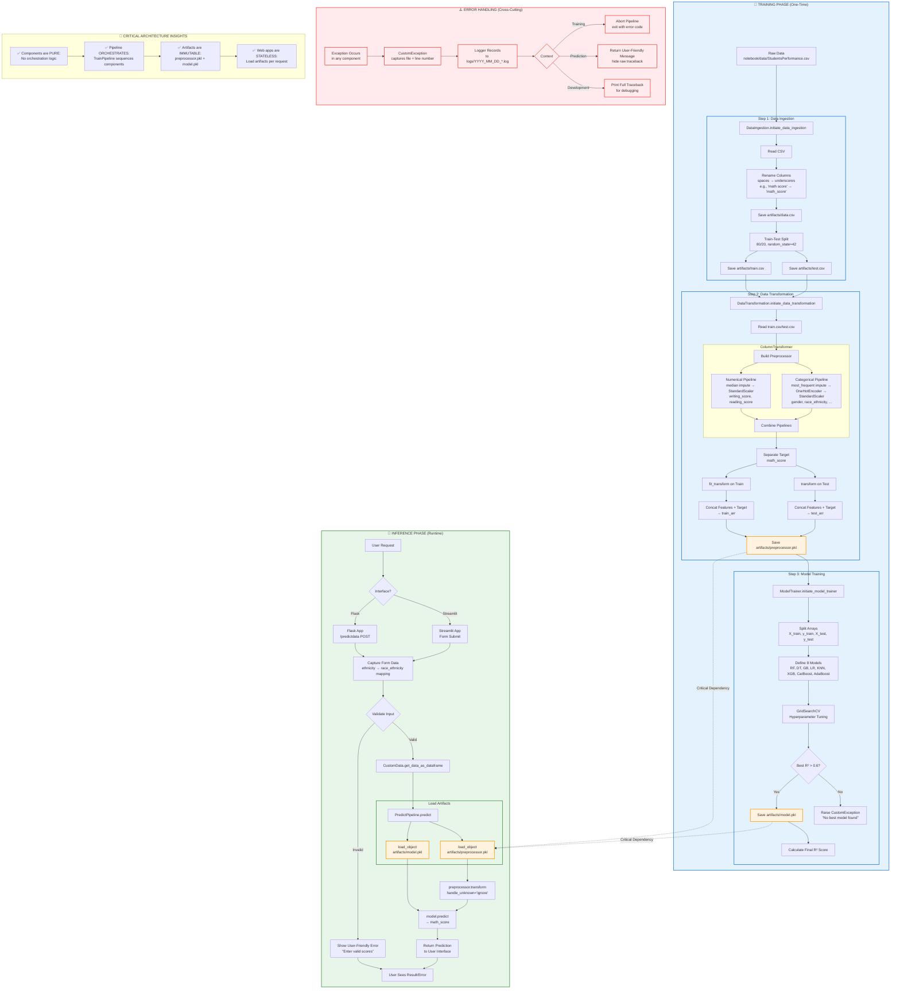
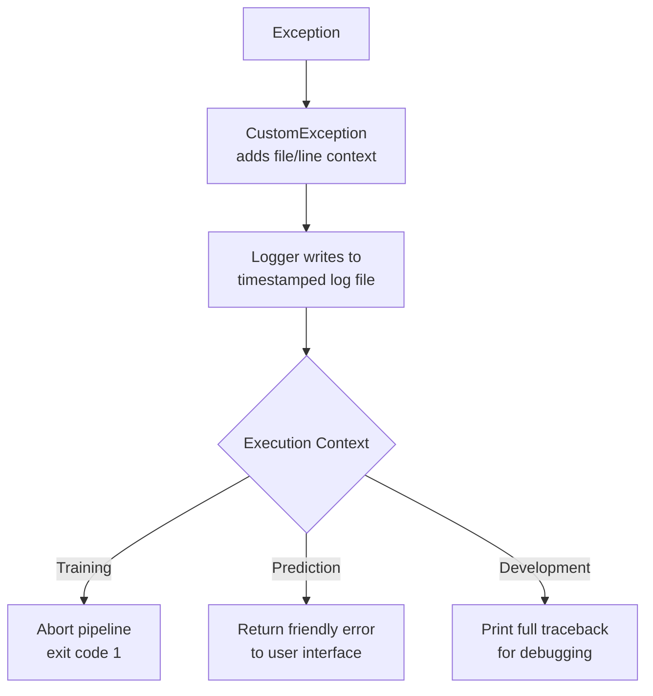
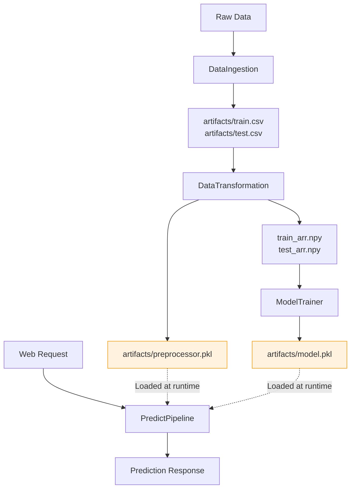

## Training Phase Flow (Left Side)

```mermaid
flowchart TD
    %% ========================================
    %% TRAINING PHASE (Left Side)
    %% ========================================
    subgraph Training_Phase ["🎯 TRAINING PHASE (One-Time)"]
        direction TB
        
        A[Raw Data<br>notebook/data/StudentsPerformance.csv] --> B[DataIngestion.initiate_data_ingestion]
        
        subgraph Data_Ingestion ["Step 1: Data Ingestion"]
            B --> B1[Read CSV]
            B1 --> B2[Rename Columns<br>spaces → underscores<br>e.g., 'math score' → 'math_score']
            B2 --> B3[Save artifacts/data.csv]
            B3 --> B4[Train-Test Split<br>80/20, random_state=42]
            B4 --> B5[Save artifacts/train.csv]
            B4 --> B6[Save artifacts/test.csv]
        end
        
        B5 & B6 --> C[DataTransformation.initiate_data_transformation]
        
        subgraph Data_Transformation ["Step 2: Data Transformation"]
            C --> C1[Read train.csv/test.csv]
            C1 --> C2[Build Preprocessor]
            
            subgraph Preprocessor ["ColumnTransformer"]
                C2 --> C2a[Numerical Pipeline<br>median impute → StandardScaler<br>writing_score, reading_score]
                C2 --> C2b[Categorical Pipeline<br>most_frequent impute → OneHotEncoder → StandardScaler<br>gender, race_ethnicity, ...]
                C2a --> C2c[Combine Pipelines]
                C2b --> C2c
            end
            
            C2c --> C3[Separate Target<br>math_score]
            C3 --> C4[fit_transform on Train]
            C3 --> C5[transform on Test]
            C4 --> C6[Concat Features + Target<br>→ train_arr]
            C5 --> C7[Concat Features + Target<br>→ test_arr]
            C6 --> C8[Save artifacts/preprocessor.pkl]
            C7 --> C8
        end
        
        C8 --> D[ModelTrainer.initiate_model_trainer]
        
        subgraph Model_Training ["Step 3: Model Training"]
            D --> D1[Split Arrays<br>X_train, y_train, X_test, y_test]
            D1 --> D2[Define 8 Models<br>RF, DT, GB, LR, KNN, XGB, CatBoost, AdaBoost]
            D2 --> D3[GridSearchCV<br>Hyperparameter Tuning]
            D3 --> D4{Best R² > 0.6?}
            D4 -->|Yes| D5[Save artifacts/model.pkl]
            D4 -->|No| D6[Raise CustomException<br>“No best model found”]
            D5 --> D7[Calculate Final R² Score]
        end
    end
    
    %% ========================================
    %% INFERENCE PHASE (Right Side)
    %% ========================================
    subgraph Inference_Phase ["🚀 INFERENCE PHASE (Runtime)"]
        direction TB
        
        E[User Request] --> F{Interface?}
        
        F -->|Flask| G[Flask App<br>/predictdata POST]
        F -->|Streamlit| H[Streamlit App<br>Form Submit]
        
        G --> I[Capture Form Data<br>ethnicity → race_ethnicity mapping]
        H --> I
        
        I --> J{Validate Input}
        J -->|Invalid| K[Show User-Friendly Error<br>“Enter valid scores”]
        J -->|Valid| L[CustomData.get_data_as_dataframe]
        
        L --> M[PredictPipeline.predict]
        
        subgraph Artifact_Loading ["Load Artifacts"]
            M --> M1[load_object<br>artifacts/preprocessor.pkl]
            M --> M2[load_object<br>artifacts/model.pkl]
        end
        
        M1 --> N[preprocessor.transform<br>handle_unknown='ignore']
        M2 --> O[model.predict<br>→ math_score]
        N --> O
        O --> P[Return Prediction<br>to User Interface]
        K --> Q[User Sees Result/Error]
        P --> Q
    end
    
    %% ========================================
    %% ERROR HANDLING (Cross-Cutting)
    %% ========================================
    subgraph Error_Handling ["⚠️ ERROR HANDLING (Cross-Cutting)"]
        direction LR
        
        R[Exception Occurs<br>in any component] --> S[CustomException<br>captures file + line number]
        S --> T[Logger Records<br>to logs/YYYY_MM_DD_*.log]
        T --> U{Context}
        
        U -->|Training| V[Abort Pipeline<br>exit with error code]
        U -->|Prediction| W[Return User-Friendly Message<br>hide raw traceback]
        U -->|Development| X[Print Full Traceback<br>for debugging]
    end
    
    %% ========================================
    %% ARTIFACT FLOW (Critical Connection)
    %% ========================================
    D5 -.->|Critical Dependency| M1
    C8 -.->|Critical Dependency| M1
    
    %% ========================================
    %% STYLING
    %% ========================================
    classDef training fill:#e3f2fd,stroke:#1976d2,stroke-width:2px
    classDef inference fill:#e8f5e9,stroke:#388e3c,stroke-width:2px
    classDef error fill:#ffebee,stroke:#f44336,stroke-width:2px
    classDef artifact fill:#fff3e0,stroke:#ff9800,stroke-width:2px
    
    class Training_Phase,Data_Ingestion,Data_Transformation,Model_Training training
    class Inference_Phase,Artifact_Loading inference
    class Error_Handling,R,S,T,U,V,W,X error
    class M1,M2,D5,C8 artifact
    
    %% ========================================
    %% KEY INSIGHTS (Bottom Annotations)
    %% ========================================
    subgraph Key_Insights ["🔑 CRITICAL ARCHITECTURE INSIGHTS"]
        direction LR
        
        K1[✅ Components are PURE:<br>No orchestration logic] --> K2[✅ Pipeline ORCHESTRATES:<br>TrainPipeline sequences components]
        K2 --> K3[✅ Artifacts are IMMUTABLE:<br>preprocessor.pkl + model.pkl]
        K3 --> K4[✅ Web apps are STATELESS:<br>Load artifacts per request]
    end
```

## Error Handling Flow (Cross-Cutting)

---

```mermaid
flowchart TD
    A[Exception] --> B[CustomException<br>adds file/line context]
    B --> C[Logger writes to<br>timestamped log file]
    C --> D{Execution Context}
    D -->|Training| E[Abort pipeline<br>exit code 1]
    D -->|Prediction| F[Return friendly error<br>to user interface]
    D -->|Development| G[Print full traceback<br>for debugging]
```

---
## Artifact Flow Diagram (Simplified View)

```mermaid
flowchart TD
    A[Raw Data] --> B[DataIngestion]
    B --> C[artifacts/train.csv<br>artifacts/test.csv]
    C --> D[DataTransformation]
    D --> E[artifacts/preprocessor.pkl]
    D --> F[train_arr.npy<br>test_arr.npy]
    F --> G[ModelTrainer]
    G --> H[artifacts/model.pkl]
    
    I[Web Request] --> J[PredictPipeline]
    E -.->|Loaded at runtime| J
    H -.->|Loaded at runtime| J
    J --> K[Prediction Response]
    
    classDef artifact fill:#fff3e0,stroke:#ff9800
    class E,H artifact
```