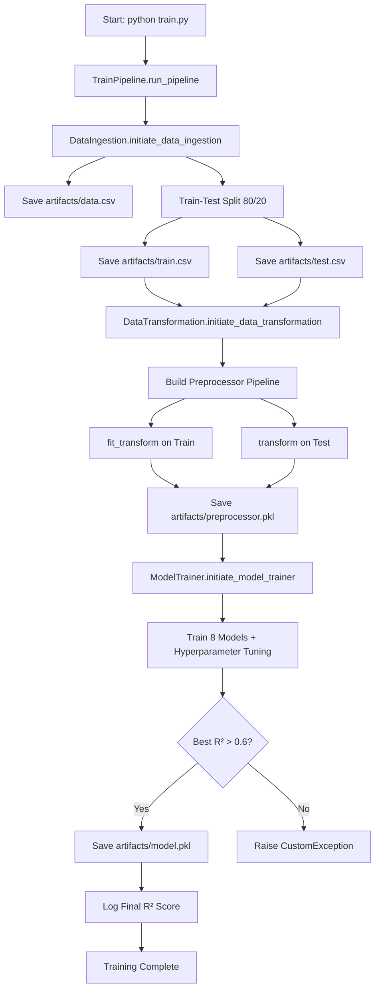
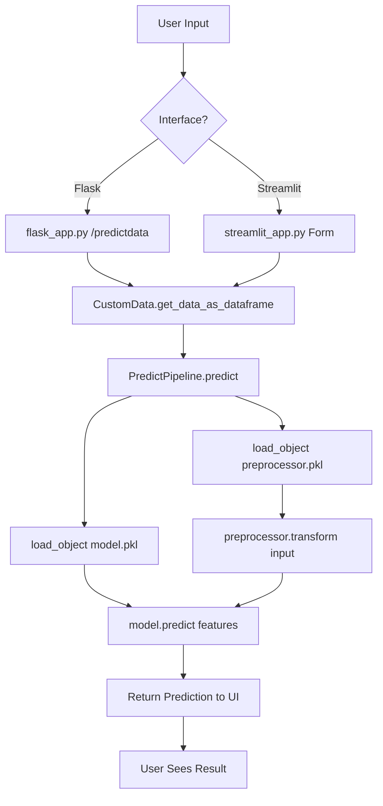
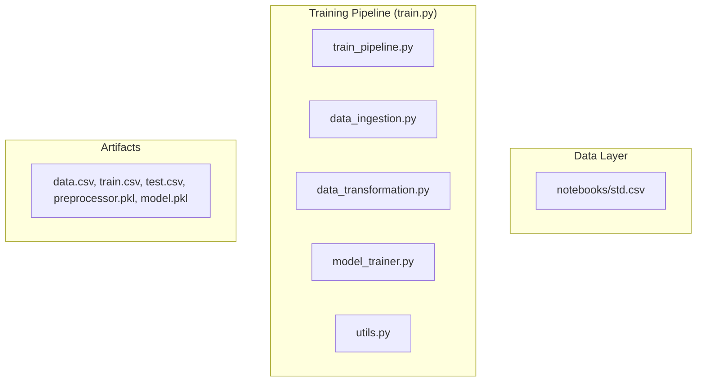

### Complete Training Workflow


### Complete Inference Workflow



```mermaid
flowchart TD
    subgraph A [Data Layer]
        A1[Data Sources<br>DBs / APIs / Files / Streams]
        A2[Data Lake / Warehouse<br>Raw Storage]
        A3[Feature
```


